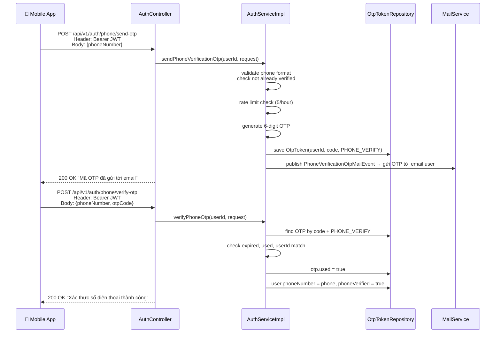
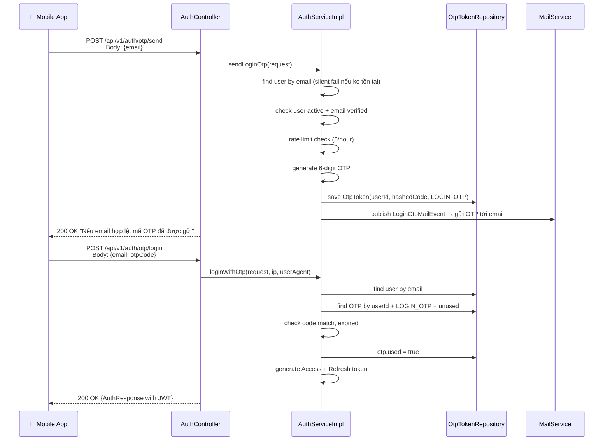

# 📱 Kế Hoạch: API OTP Cho Mobile (v2 — Email OTP)

> Gửi OTP qua **email (Gmail/SMTP)** — tận dụng `MailService` đã có sẵn.
> Không dùng SMS. Không cần thêm dependency ngoài.

---

## 1. Hai Flow Cần Triển Khai

### Flow A — Xác thực số điện thoại (Authenticated)

> User đã đăng nhập, muốn gắn/xác thực phone number.

### Flow C — Đăng nhập bằng email OTP (Public)

> User mở app mobile, nhập email, nhận OTP qua email, đăng nhập không cần password.

---

## 2. Tóm Tắt Endpoints

| # | Endpoint | Method | Auth | Mô tả |
|---|---|---|---|---|
| 1 | `/api/v1/auth/phone/send-otp` | POST | 🔒 Authenticated | Gửi OTP tới email để xác thực phone |
| 2 | `/api/v1/auth/phone/verify-otp` | POST | 🔒 Authenticated | Verify OTP → gắn phone vào tài khoản |
| 3 | `/api/v1/auth/otp/send` | POST | 🌐 Public | Gửi OTP đăng nhập tới email |
| 4 | `/api/v1/auth/otp/login` | POST | 🌐 Public | Đăng nhập bằng email + OTP |

---

## 3. Tận Dụng Codebase Hiện Tại

| Có sẵn | Cách tận dụng |
|---|---|
| `MailService` + `MailDispatchListener` | Thêm 2 event mới + 2 method gửi mail OTP |
| `OtpToken` entity | Tái sử dụng 100%, chỉ thêm 2 `OtpType` mới |
| `OtpTokenRepository` | Thêm query rate limit + tìm OTP theo userId |
| `User.phoneNumber` + `phoneVerified` | Đã có sẵn columns, chỉ cần logic update |
| `AuthErrorCode` | Thêm vài mã lỗi mới |
| `DomainEventPublisher` | Tái sử dụng, publish event mới |
| Email template (Thymeleaf) | Thêm template OTP 6 chữ số |

> [!TIP]
> **Không cần thêm dependency nào** — toàn bộ tận dụng `spring-boot-starter-mail` và Thymeleaf đã có.

---

## 4. Files Cần Tạo/Sửa

### 4.1. Files mới (6 files)

| # | File | Mô tả |
|---|---|---|
| 1 | `auth/dto/request/SendPhoneOtpRequest.java` | DTO: `phoneNumber` |
| 2 | `auth/dto/request/VerifyPhoneOtpRequest.java` | DTO: `phoneNumber` + `otpCode` |
| 3 | `auth/dto/request/SendLoginOtpRequest.java` | DTO: `email` |
| 4 | `auth/dto/request/LoginOtpRequest.java` | DTO: `email` + `otpCode` |
| 5 | `common/event/PhoneVerificationOtpMailEvent.java` | Event gửi OTP verify phone |
| 6 | `common/event/LoginOtpMailEvent.java` | Event gửi OTP login |

### 4.2. Files sửa (7 files)

| # | File | Thay đổi |
|---|---|---|
| 1 | `auth/entity/OtpType.java` | +`PHONE_VERIFY`, +`LOGIN_OTP` |
| 2 | `auth/exception/AuthErrorCode.java` | +`PHONE_ALREADY_VERIFIED`, +`OTP_RATE_LIMITED`, +`INVALID_PHONE_NUMBER` |
| 3 | `auth/repository/OtpTokenRepository.java` | +query đếm OTP rate limit |
| 4 | `auth/repository/UserRepository.java` | +`findByPhoneNumber()`, +`existsByPhoneNumber()` |
| 5 | `auth/service/AuthService.java` | +4 methods mới |
| 6 | `auth/service/impl/AuthServiceImpl.java` | Implement 4 methods + OTP numeric generator |
| 7 | `auth/controller/AuthController.java` | +4 endpoints mới |
| 8 | `infrastructure/mail/MailService.java` | +2 methods gửi mail OTP |
| 9 | `infrastructure/mail/impl/...` | Implement 2 methods |
| 10 | `infrastructure/mail/listener/MailDispatchListener.java` | +2 event handlers |
| 11 | `config/SecurityConfig.java` | Thêm 2 public endpoints (otp/send, otp/login) |

### 4.3. Test files (3 files)

| # | File | Cases |
|---|---|---|
| 1 | `auth/service/impl/AuthServicePhoneOtpTest.java` | ~12 cases (Flow A + C service logic) |
| 2 | `auth/controller/AuthControllerPhoneOtpTest.java` | ~10 cases (Flow A — authenticated endpoints) |
| 3 | `auth/controller/AuthControllerLoginOtpTest.java` | ~10 cases (Flow C — public endpoints) |

---

## 5. Ma Trận Test Cases

### Flow A — Verify Phone (Service Tests)

| # | Test | Expected |
|---|---|---|
| 1 | `sendPhoneOtp_success_savesOtpAndPublishesEvent` | OTP saved, email event published |
| 2 | `sendPhoneOtp_phoneAlreadyVerified_throwsException` | `PHONE_ALREADY_VERIFIED` |
| 3 | `sendPhoneOtp_invalidPhoneFormat_throwsException` | `INVALID_PHONE_NUMBER` |
| 4 | `sendPhoneOtp_rateLimited_throwsException` | `OTP_RATE_LIMITED` |
| 5 | `verifyPhoneOtp_success_setsPhoneVerified` | `phoneVerified=true`, OTP `used=true` |
| 6 | `verifyPhoneOtp_expired_throwsException` | `OTP_EXPIRED` |
| 7 | `verifyPhoneOtp_wrongCode_throwsException` | `INVALID_OTP` |
| 8 | `verifyPhoneOtp_alreadyUsed_throwsException` | `INVALID_OTP` |

### Flow C — Login OTP (Service Tests)

| # | Test | Expected |
|---|---|---|
| 9 | `sendLoginOtp_success_savesOtpAndPublishesEvent` | OTP saved, email event published |
| 10 | `sendLoginOtp_unknownEmail_silentlyReturns` | No exception (anti-enumeration) |
| 11 | `sendLoginOtp_rateLimited_throwsException` | `OTP_RATE_LIMITED` |
| 12 | `loginWithOtp_success_returnsAuthResponse` | Access + Refresh tokens |
| 13 | `loginWithOtp_wrongCode_throwsException` | `INVALID_OTP` |
| 14 | `loginWithOtp_expired_throwsException` | `OTP_EXPIRED` |
| 15 | `loginWithOtp_accountDisabled_throwsException` | `ACCOUNT_DISABLED` |
| 16 | `loginWithOtp_emailNotVerified_throwsException` | `EMAIL_NOT_VERIFIED` |

### Controller Tests (MockMvc)

| # | Test | Endpoint | Expected |
|---|---|---|---|
| 17 | `sendPhoneOtp_success_200` | Phone send | 200 |
| 18 | `sendPhoneOtp_blankPhone_400` | Phone send | 400 validation |
| 19 | `sendPhoneOtp_invalidPhone_400` | Phone send | 400 pattern |
| 20 | `verifyPhoneOtp_success_200` | Phone verify | 200 |
| 21 | `verifyPhoneOtp_blankOtp_400` | Phone verify | 400 validation |
| 22 | `verifyPhoneOtp_otpWrongSize_400` | Phone verify | 400 size |
| 23 | `sendLoginOtp_success_200` | OTP send | 200 |
| 24 | `sendLoginOtp_blankEmail_400` | OTP send | 400 validation |
| 25 | `sendLoginOtp_invalidEmail_400` | OTP send | 400 format |
| 26 | `loginOtp_success_200` | OTP login | 200 + AuthResponse |
| 27 | `loginOtp_blankOtp_400` | OTP login | 400 validation |
| 28 | `loginOtp_invalidOtp_400` | OTP login | 400 `INVALID_OTP` |

---

## 6. Business Rules

| Rule | Chi tiết |
|---|---|
| **OTP format** | 6 chữ số (000000-999999) |
| **OTP TTL** | 5 phút |
| **Rate limit** | 5 OTP/giờ per user |
| **Anti-enumeration** | `send` endpoints luôn trả 200, dù email/phone không tồn tại |
| **Phone format** | Regex `^\+?[1-9]\d{7,14}$` (E.164) |
| **OTP cũ** | Khi gửi OTP mới, invalidate tất cả OTP cũ cùng type |
| **Phone unique** | Mỗi phone chỉ gắn được 1 user |

---

## 7. Ước Tính

| Metric | Số lượng |
|---|---|
| Files mới | 6 |
| Files sửa | ~11 |
| Test files | 3 |
| Test cases | **28** |
| Endpoints mới | 4 |
| Dependencies mới | **0** (tận dụng mail + OTP hiện có) |
