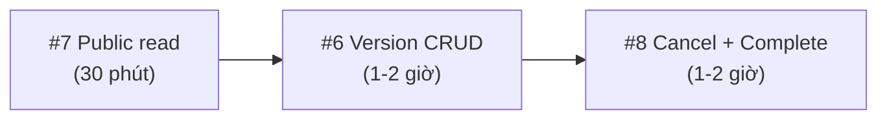

# P1 Implementation Plan — Backend API Gaps

> [!IMPORTANT]
> Plan này cần bạn review và chốt trước khi code. Mỗi hạng mục có phần **Câu hỏi cần chốt** — hãy trả lời để mình bắt đầu.

---

## Tổng quan P1

| # | Hạng mục | Độ phức tạp | Files ảnh hưởng |
|---|----------|-------------|-----------------|
| 6 | Service package version CRUD (update, delete, set default) | Thấp | ~6 files |
| 7 | Public version/curriculum read (bỏ MENTOR-only) | Rất thấp | ~3 files |
| 8 | Booking scheduling / cancel booking | Trung bình-Cao | ~15+ files |

---

## Hạng mục #6: Service package version management

### Hiện trạng

Đã có:
- `POST /{id}/versions` — tạo version mới
- `GET /{id}/versions` — list versions (MENTOR only)
- `GET /{id}/versions/{versionId}` — detail version (MENTOR only)

Còn thiếu:
- **Update version** (price, duration, deliveryType)
- **Delete/archive version**
- **Set default version**

### Kế hoạch

#### 6.1 — Thêm DTO `UpdateServicePackageVersionRequest`

```java
// modules/service/dto/request/UpdateServicePackageVersionRequest.java
@Data
public class UpdateServicePackageVersionRequest {
    @DecimalMin("0.0") private BigDecimal price;
    @Min(1) private Integer duration;
    private String deliveryType;
}
```

> [!NOTE]
> Dùng partial update: field nào `null` thì giữ nguyên. Khác với Create request bắt buộc `@NotNull`.

#### 6.2 — Thêm 3 method vào `CatalogService` interface

```java
ServicePackageVersionResponse updatePackageVersion(UUID mentorId, UUID packageId, UUID versionId, UpdateServicePackageVersionRequest request);
void deletePackageVersion(UUID mentorId, UUID packageId, UUID versionId);
ServicePackageVersionResponse setDefaultVersion(UUID mentorId, UUID packageId, UUID versionId);
```

#### 6.3 — Implement trong `CatalogServiceImpl`

**updatePackageVersion:**
- `requireOwnedVersionForMutation()` (đã có helper)
- Update các field non-null
- Save & return

**deletePackageVersion:**
- `requireOwnedVersionForMutation()`
- **Business rule 1:** Check version có booking/order nào đang active không → cần query `BookingRepository` hoặc `OrderRepository`
- **Business rule 2:** Nếu version là `isDefault=true` → không cho xóa (hoặc tự set default sang version khác)
- **Business rule 3:** Package phải còn ít nhất 1 version sau khi xóa
- Hard delete (vì version không có `deletedAt`) hoặc thêm soft delete

**setDefaultVersion:**
- `requireOwnedVersionForMutation()`
- Unset `isDefault` trên tất cả version cùng package
- Set `isDefault=true` cho version được chọn

#### 6.4 — Thêm error codes vào `ServiceErrorCode`

```java
VERSION_HAS_ACTIVE_BOOKINGS(409, "VERSION_HAS_ACTIVE_BOOKINGS"),
CANNOT_DELETE_DEFAULT_VERSION(409, "CANNOT_DELETE_DEFAULT_VERSION"),
PACKAGE_MUST_HAVE_VERSION(400, "PACKAGE_MUST_HAVE_VERSION"),
```

#### 6.5 — Thêm 3 endpoint vào `ServicePackageController`

```java
PUT  /{id}/versions/{versionId}          → updatePackageVersion
DELETE /{id}/versions/{versionId}        → deletePackageVersion
PATCH  /{id}/versions/{versionId}/default → setDefaultVersion
```

Tất cả `@PreAuthorize("hasRole('MENTOR')")`.

#### 6.6 — Repository: thêm query check booking

```java
// ServicePackageVersionRepository — thêm:
long countByPackageId(UUID packageId);

// BookingRepository hoặc OrderRepository — thêm check:
// Có order/booking nào đang dùng versionId này không?
```

### Câu hỏi cần chốt #6

1. **Delete version:** Hard delete hay soft delete (thêm `deletedAt`)?
   - Đề xuất: **Hard delete** nếu không có order nào dùng, reject nếu có order.
2. **Khi xóa default version:** Reject luôn hay tự chuyển default sang version gần nhất?
   - Đề xuất: **Reject** — mentor phải set default khác trước khi xóa.
3. **Có cần check order dùng version không?** Hiện tại `orders.service_id` reference đến `service_package_versions(id)`.
   - Đề xuất: **Có** — không cho xóa version đã có order (dù order đã completed).

---

## Hạng mục #7: Public package version/curriculum read

### Hiện trạng

Trong [ServicePackageController.java](file:///d:/Projects/Sociedu/sociedu-api/src/main/java/com/unishare/api/modules/service/controller/ServicePackageController.java#L89-L138):
- `GET /{id}/versions` — **MENTOR only** ❌
- `GET /{id}/versions/{versionId}` — **MENTOR only** ❌
- `GET /{id}/versions/{versionId}/curriculums` — **MENTOR only** ❌

Buyer cần xem version/curriculum **trước khi checkout** để biết nội dung gói.

### Kế hoạch

#### 7.1 — Thêm 3 public read methods vào `CatalogService`

```java
Page<ServicePackageVersionResponse> getActivePackageVersions(UUID packageId, Pageable pageable);
ServicePackageVersionResponse getActivePackageVersion(UUID packageId, UUID versionId);
Page<CurriculumItemResponse> getActiveVersionCurriculums(UUID packageId, UUID versionId, Pageable pageable);
```

Logic: chỉ trả về versions/curriculums của package **active + not deleted**.

#### 7.2 — Implement trong `CatalogServiceImpl`

```java
// Reuse existing helpers, nhưng không check mentorId ownership
public Page<ServicePackageVersionResponse> getActivePackageVersions(UUID packageId, Pageable pageable) {
    ServicePackage pkg = servicePackageRepository.findActiveById(packageId)
            .orElseThrow(() -> new AppException(ServiceErrorCode.PACKAGE_NOT_FOUND));
    return servicePackageVersionRepository.findByPackageId(pkg.getId(), pageable)
            .map(this::mapToVersionResponse);
}
```

#### 7.3 — Thêm 3 public endpoint vào `ServicePackageController`

```java
@Operation(summary = "Danh sach version cua goi dich vu (public)")
@GetMapping("/{id}/versions")               // ← SỬA: bỏ @PreAuthorize, bỏ principal
// Hoặc tách path: GET /{id}/public-versions  // ← nếu muốn giữ nguyên endpoint cũ

@GetMapping("/{id}/versions/{versionId}")    // ← SỬA tương tự
@GetMapping("/{id}/versions/{versionId}/curriculums")
```

> [!WARNING]
> **Conflict:** Hiện tại GET `/{id}/versions` đã có với `@PreAuthorize("hasRole('MENTOR')")`. Cần quyết định:
> - **Option A:** Biến endpoint hiện tại thành public, mentor vẫn dùng qua `MentorCatalogController` (`/mentors/me/packages/...`)
> - **Option B:** Tạo endpoint mới riêng với path khác

### Câu hỏi cần chốt #7

1. **Option A hay B?**
   - Đề xuất: **Option A** — biến `GET /service-packages/{id}/versions` thành public (bỏ `@PreAuthorize`). Mentor đã có route qua `/mentors/me/packages/{pkgId}` (MentorCatalogController). Endpoint public chỉ trả version của package active.
2. **Public có trả curriculums luôn trong version response không?** (hiện tại `mapToVersionResponse` đã include curriculums)
   - Đề xuất: **Có** — buyer cần xem nội dung buổi học.

---

## Hạng mục #8: Booking scheduling / cancel

### Hiện trạng

Đã có:
- `GET /bookings/me/buyer`, `GET /bookings/me/mentor`, `GET /bookings/{id}`
- `PATCH /bookings/{bookingId}/sessions/{sessionId}` — generic update (schedule, status, meetingUrl, cancel)
- `POST /bookings/{bookingId}/sessions/{sessionId}/evidences`

Còn thiếu theo gaps doc:
1. ~~Mentor availability slots~~ → **đề xuất defer sang P2** (phức tạp, cần entity/table mới)
2. ~~Reschedule request flow~~ → **đề xuất defer sang P2** (cần entity/table mới + approval flow)
3. **Cancel booking** ← làm ngay
4. **Dedicated complete session** ← đã có logic trong PATCH, chỉ cần dedicated endpoint

### Kế hoạch (scope rút gọn cho MVP)

> [!TIP]
> Reschedule và Availability là feature phức tạp cần entity mới, bảng mới, approval flow. Đề xuất **chỉ làm Cancel booking + Complete session** cho P1, còn lại chuyển P2.

#### 8.1 — Cancel Booking endpoint

**Endpoint:** `POST /api/v1/bookings/{bookingId}/cancel`

**DTO mới:**
```java
// CancelBookingRequest.java
@Data
public class CancelBookingRequest {
    @NotBlank private String reason;
}
```

**Logic:**
1. Chỉ buyer hoặc mentor của booking được cancel
2. Validate state transition: chỉ từ `PENDING`, `SCHEDULED`, `IN_PROGRESS` → `CANCELED`
3. Cancel tất cả sessions chưa completed (set status = `canceled`, `canceledBy`, `cancelReason`)
4. Set booking status = `CANCELED`
5. Publish `BookingCanceledEvent`

**Files ảnh hưởng:**
- `BookingService.java` — thêm method `cancelBooking(UUID bookingId, UUID userId, CancelBookingRequest req)`
- `BookingServiceImpl.java` — implement
- `BookingController.java` — thêm endpoint
- `BookingStatusTransitionPolicy.java` — verify `CANCELED` transition đã có

#### 8.2 — Complete Session endpoint (dedicated)

**Endpoint:** `POST /api/v1/bookings/{bookingId}/sessions/{sessionId}/complete`

Logic đã có trong `updateSession()` khi `status = "completed"`. Tạo dedicated endpoint gọi lại cùng logic.

**Files ảnh hưởng:**
- `BookingService.java` — thêm method `completeSession(UUID bookingId, UUID sessionId, UUID userId)`
- `BookingServiceImpl.java` — extract logic từ `updateSession`
- `BookingController.java` — thêm endpoint

#### 8.3 — (Optional) Mentor Availability Slots — ĐỀ XUẤT CHUYỂN P2

Nếu bạn muốn làm luôn, cần:
- **Entity mới:** `MentorAvailabilitySlot` (mentorId, dayOfWeek, startTime, endTime, isRecurring)
- **Bảng mới:** `mentor_availability_slots`
- **Repository:** `MentorAvailabilitySlotRepository`
- **DTO:** `AvailabilitySlotRequest`, `AvailabilitySlotResponse`
- **Service:** `MentorAvailabilityService`
- **Controller:** endpoints trên `MentorController` hoặc tách riêng
- **Logic:** validate khi schedule session phải nằm trong availability

#### 8.4 — (Optional) Reschedule Request Flow — ĐỀ XUẤT CHUYỂN P2

Nếu bạn muốn làm luôn, cần:
- **Entity mới:** `RescheduleRequest` (sessionId, requestedBy, newScheduledAt, status, reason)
- **Bảng mới:** `reschedule_requests`
- **Approval flow:** request → approve/reject
- **Notification** khi có request mới

### Câu hỏi cần chốt #8

1. **Scope P1:** Chỉ làm **Cancel booking + Complete session** (đề xuất), hay làm thêm Availability / Reschedule?
2. **Cancel booking:** Cả buyer lẫn mentor đều cancel được, hay chỉ buyer?
   - Đề xuất: **Cả hai** — nhưng có thể thêm rule (vd: mentor cancel trong vòng X giờ trước session)
3. **Cancel booking tự động refund?** Hay refund là process riêng?
   - Đề xuất: **Publish event** `BookingCanceledEvent`, refund xử lý riêng (P2)
4. **Complete session:** Giữ validation hiện tại (phải IN_PROGRESS trước, min 15 phút)?
   - Đề xuất: **Giữ nguyên** — logic đã solid

---

## Thứ tự triển khai đề xuất



1. **#7 trước** — đơn giản nhất, chỉ bỏ auth + thêm method
2. **#6 tiếp** — thêm 3 endpoint + business rules
3. **#8 cuối** — phức tạp nhất nhưng scope đã rút gọn

---

## Tóm tắt files sẽ tạo/sửa

### Files mới tạo
| File | Mô tả |
|------|--------|
| `UpdateServicePackageVersionRequest.java` | DTO update version |
| `CancelBookingRequest.java` | DTO cancel booking |

### Files sẽ sửa
| File | Thay đổi |
|------|----------|
| `CatalogService.java` | +6 methods (3 cho #6, 3 cho #7) |
| `CatalogServiceImpl.java` | +6 implementations |
| `ServicePackageController.java` | +3 endpoints (#6), sửa 3 endpoints (#7) |
| `ServiceErrorCode.java` | +3 error codes |
| `ServicePackageVersionRepository.java` | +1 query |
| `BookingService.java` | +2 methods (#8) |
| `BookingServiceImpl.java` | +2 implementations |
| `BookingController.java` | +2 endpoints (#8) |
| `BookingErrorCode.java` | +1-2 error codes |

**Tổng: ~2 files mới, ~9 files sửa**
