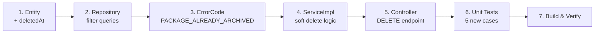

# 📦 Kế Hoạch: Service Package — Soft Delete + DELETE Endpoint

> **Quyết định đã chốt:**
> - ✅ Soft delete (`deletedAt`) để giữ booking history
> - ✅ `DELETE /{id}` = archive (set `deletedAt`), không xóa cứng
> - ❌ Không cần duplicate/rating package ở phase này
> - ✅ Integration tests cho create/update flow

---

## 1. Phân Tích Hiện Trạng

### Tests đã có (22 cases — ĐẦY ĐỦ CRUD)

| # | Test | Status |
|---|------|--------|
| 1 | `createPackage_validRequest` | ✅ |
| 2 | `createPackage_duplicateOrderIndex` | ✅ |
| 3 | `createPackage_persistOneDefaultVersion` | ✅ |
| 4 | `getMentorPackages_paged` | ✅ |
| 5 | `getMyPackages_activeAndInactive` | ✅ |
| 6 | `getMyPackage_ownedExists` | ✅ |
| 7 | `getPackageVersions_paged` | ✅ |
| 8 | `getPackageVersion_ownedExists` | ✅ |
| 9 | `getActivePackages_paged` | ✅ |
| 10 | `getActivePackage_exists` | ✅ |
| 11 | `getActivePackage_missing_throws` | ✅ |
| 12 | `createPackageVersion_success` | ✅ |
| 13 | `createPackageVersion_noDefault_throws` | ✅ |
| 14 | `createPackageVersion_notOwner_throws` | ✅ |
| 15 | `updatePackage_success` | ✅ |
| 16 | `updatePackage_notOwner_throws` | ✅ |
| 17 | `togglePackage_activeToInactive` | ✅ |
| 18 | `togglePackage_inactiveToActive` | ✅ |
| 19 | `togglePackage_notOwner_throws` | ✅ |
| 20 | `updateCurriculumItem_success` | ✅ |
| 21 | `updateCurriculumItem_duplicateOrder` | ✅ |
| 22 | `updateCurriculumItem_wrongVersion` | ✅ |
| 23 | `addCurriculumItem_duplicateOrder` | ✅ |
| 24 | `listCurriculum_paged` | ✅ |
| 25 | `deleteCurriculumItem_success` | ✅ |

### Code thiếu gì?

| # | Thiếu | Giải pháp |
|---|-------|-----------|
| 1 | Field `deletedAt` trên `ServicePackage` | Thêm field + annotation |
| 2 | Tất cả repository queries **không lọc** soft-deleted packages | Thêm `AND p.deletedAt IS NULL` |
| 3 | `deletePackage()` hard-deletes cascade | Đổi thành set `deletedAt = now()` |
| 4 | **Không có** `@DeleteMapping("/{id}")` trên controller | Thêm endpoint |
| 5 | Error code cho package đã bị archive | Thêm `PACKAGE_ALREADY_ARCHIVED` |
| 6 | Tests cho soft delete flow | Thêm 5 cases |

---

## 2. Chi Tiết Thay Đổi (6 Files)

### File 1: `ServicePackage.java` — Thêm `deletedAt`

```diff
+    @Column(name = "deleted_at")
+    private Instant deletedAt;
+
+    public boolean isDeleted() {
+        return deletedAt != null;
+    }
```

### File 2: `ServicePackageRepository.java` — Filter `deletedAt IS NULL`

Tất cả 6 JPQL queries cần thêm `AND p.deletedAt IS NULL`:

| Query | Thay đổi |
|-------|----------|
| `searchActivePackages` | `AND p.deletedAt IS NULL` |
| `searchActiveByMentorId` | `AND p.deletedAt IS NULL` |
| `searchByMentorId` | `AND p.deletedAt IS NULL` |
| `findByIdAndIsActiveTrue` | + `AND deletedAt IS NULL` (derived query → JPQL) |
| `findByMentorId` (2 overloads) | + `AndDeletedAtIsNull` suffix |

### File 3: `ServiceErrorCode.java` — Thêm error code

```diff
+    PACKAGE_ALREADY_ARCHIVED(400, "PACKAGE_ALREADY_ARCHIVED");
```

### File 4: `CatalogServiceImpl.java` — Soft delete logic

```diff
 // deletePackage: hard delete → soft delete
-    List<ServicePackageVersion> versions = ...
-    for (ServicePackageVersion v : versions) { ... delete cascade }
-    servicePackageRepository.delete(pkg);
+    if (pkg.isDeleted()) {
+        throw new AppException(ServiceErrorCode.PACKAGE_ALREADY_ARCHIVED, ...);
+    }
+    pkg.setDeletedAt(Instant.now());
+    pkg.setIsActive(false);
+    servicePackageRepository.save(pkg);
```

### File 5: `ServicePackageController.java` — Thêm DELETE endpoint

```java
@Operation(summary = "Xóa (archive) gói dịch vụ")
@SecurityRequirement(name = OpenApiConfig.BEARER_JWT)
@PreAuthorize("hasRole('MENTOR')")
@DeleteMapping("/{id}")
public ResponseEntity<ApiResponse<Void>> deletePackage(
        @AuthenticationPrincipal CustomUserPrincipal principal,
        @PathVariable UUID id) {
    catalogService.deletePackage(principal.getUserId(), id);
    return ResponseEntity.ok(ApiResponse.<Void>build()
            .withMessage("Đã xóa gói dịch vụ."));
}
```

### File 6: `CatalogServiceImplTest.java` — Thêm 5 tests

| # | Test Case | Expected |
|---|-----------|----------|
| 26 | `deletePackage_success_setsDeletedAtAndInactive` | `deletedAt != null`, `isActive = false` |
| 27 | `deletePackage_notOwner_throws` | `PACKAGE_NOT_FOUND` |
| 28 | `deletePackage_alreadyArchived_throws` | `PACKAGE_ALREADY_ARCHIVED` |
| 29 | `getActivePackages_excludesDeleted` | Soft-deleted pkg không xuất hiện |
| 30 | `getMyPackages_excludesDeleted` | Mentor cũng không thấy gói đã archive |

---

## 3. Migration SQL

```sql
ALTER TABLE service_packages ADD COLUMN deleted_at TIMESTAMP NULL;
```

> [!NOTE]
> Nếu dùng Flyway/Liquibase, tạo migration file riêng. Nếu dùng `ddl-auto=update` (dev), Hibernate tự thêm.

---

## 4. Thứ Tự Triển Khai



**Estimated effort:** ~30 phút code + test.

---

## 5. Câu Hỏi Xác Nhận

> [!WARNING]
> Trước khi code:

1. **DB migration**: Bạn đang dùng Flyway/Liquibase hay `ddl-auto=update`?
2. **getMyPackages**: Mentor có nên nhìn thấy gói đã archive (với label "Đã xóa") không? Hay filter luôn?
3. **Restore**: Có cần endpoint khôi phục gói đã archive (undelete) không?
4. **Ổn chưa?** Nếu OK tôi bắt đầu code ngay.
